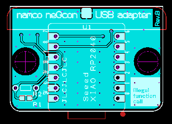

# 俺はneGconをアケアカのリッジレーサでつかいたいんじゃ、 ついでにAirCombat22も対応しておいた for RP2040 (neGcon2SwitchPICO)
  

  

  

  

  

良くあるプレステのコントローラをUSBゲームコントローラに変換するアダプタです。  
先日作ったNAMCO neGcon to Nintendo Switch ConverterはAVRで作っているため、  
色々と今だとイマイチなところが多いので改めてraspberry PICO系のマイコンボードで作り直しました。  

nintendo SWITCH向けに作りましたが、Windowsなどで汎用的に使用することが可能です。  

Nitendo Switch用アケアカ版リッジレーサでネジコンが使いたい！！

と勢いで雑に作った・・・のですが、頒布するために、もう少し真面目にコードを書き直して、  
バカでっかいFlightControllerをAirCombat22に対応させてみたり、  
DualShockの辺りをちゃんと、真面目に対応させて見たら悪くは無い出来の様な気がします。  

Switch2でも動きました・・・＼(^o^)／

## ■ 本製品の頒布について

下記ショップで取り扱っていただいています。  

###家電のKENちゃん  

完成品 (ケース色 赤/赤)  
<https://www.kadenken.com/view/item/000000001894>  

完成品 (ケース色 透明/赤)  
<https://www.kadenken.com/view/item/000000001895>  

キット版 (要半田付け　ケース無し）  
<https://www.kadenken.com/view/item/000000001893>  

※売り切れ時は、追加生産個数の参考にしたいので  
　「再入荷のお知らせを受け取る」おいていただけると幸いです。  

## 作り方
どこの誤家庭にもある、Seeed XIAO RP2040 または raspberry PICOボートとプレステのコントローラをつないでください。  
1KΩのプルアップ抵抗は必須です。DATAと3.3Vの間につけてください  

## PS1/PS2 joypad との配線 

|PSX Pin | PSX Signal | XIAO RP2040 | raspberry PICO | RP2040 Signal |
| :- |  :- |  :- |  :- |  :- |
| 1 | DAT | 9 | GP4 | MISO [need pullup by 1k owm registor to 3.3V] |
| 2 | CMD | 10 | GP3 | MOSI |
| 3 | 9V  (for motor, If you not necessary NC)| (VCC) | (VSYS) | +5V |
| 4 | GND | GND | GND | Power GND |
| 5 | 3.3V | +3V3 | 3V3 | Power 3.3V |
| 6 | Attention | 7 | GP1 | GPIO1 (Controller Select) |
| 7 | CLK | 8 | GP2 | SCK |
| 8 | NC | - | - |
| 9 | ACK | - | - |

  

  

## Firmware書き込み方法
マイコンボード上にあるBボタンまたはBOOTSELボタンを押しながらUSBケーブルを接続してください。  
PCに接続した後も念のため数秒程度はボタンを離さないようにしてください。  
上手く接続できれば回路が「RPI-RP2」という名前で、USBメモリのように認識されます。  
「RPI-RP2」を開き、「xxxxx.uf2」ファイルをドラッグ&ドロップしたら完了です。  

「./firmware」のフォルダにコンパイル済のファイルが置いてあります。  

## ボタン配置について
接続するコントローラによってボタン配置や挙動が自動的に変更されます。  

## neGcon接続時のボタン配置
neGcon接続時はBOOTボタンを押す事で設定を切り替えられます。(V1.20以降)  
アケアカのリッジレーサに最適化されたモードです。  
アナログの感度に関しては、本Adapterでも補正を少しいれていますが、さらに調整が必要な場合は、  
ゲーム内の「設定」→「ボタン」→「こだわりのボタン設定」→「感度設定」で調整可能です。  

各モードのLED色は下記の通りです。  
| LEDの色 | モード |
| :- |  :- |
| 青色 | STD筐体モード  |
| 黄色 | DX筐体モード  |
| 紫色 | STD筐体モード(I/IIボタンSWAP)  |
| 緑色 | DX筐体モード(I/IIボタンSWAP)  |
| 白色 | デジタルモード  |

### ボタン配置(アケアカ：リッジレーサ STD筐体モード)
|neGconボタン | Nintendo Switchコントローラ | 備考 |
| :- |  :- |  :- |
| ねじり (アナログ) | 左アナログスティックのX | 左アナログスティックのYは常にCenterです。 |
| I (アナログ) | 左アナログスティックのY 上方向 |  |
| II (アナログ) | 左アナログスティックのY 下方向 |  |
| L (アナログ) | Lボタン | 押し込まないと反応しません |
| R (デジタル) | Rボタン | |
| A (デジタル) | Aボタン | |
| B (デジタル) | Yボタン | |
| START (デジタル) | ＋ボタン |  |

### ボタン配置(アケアカ：リッジレーサ DX筐体モード)
| neGconボタン | Nintendo Switchコントローラ | 備考 |
| :- |  :- |  :- |
| ねじり (アナログ) | 左アナログスティックのX | 左アナログスティックのYは常にCenterです。 |
| I (アナログ) | ZRボタン | 押し込み量によって連射速度が変わります |
| II (アナログ) | ZLボタン | 押し込み量によって連射速度が変わります |
| L (アナログ) | Lボタン |  押し込まないと反応しません |
| R (デジタル) | Rボタン | |
| A (デジタル) | Aボタン | |
| B (デジタル) | Yボタン | |
| START (デジタル) | ＋ボタン |  |

## ANALOG JOYSTICK (SHPH-1110)接続時のボタン配置
アナログの感度に関しては、  
ゲーム内の「設定」→「ボタン」→「こだわりのボタン設定」→「感度設定」で調整可能です。  

### ボタン配置(アケアカ：AirCombat22モード)
| SHPH-1110 | Nintendo Switchコントローラ | 備考 |
| :- |  :- |  :- |
| 左スティック (アナログ) | 右アナログスティック | 操縦桿 |
| 右スティック (アナログ) | 左アナログスティック | スロットル |
| 右スティック HATスイッチ | 十字キー |  |
| SELECT | -ボタン |  |
| START  | +ボタン | メニュー |
| △ | Xボタン | クレジット |
| ○  | Aボタン | ミサイル |
| □ | Bボタン | バルカン |
| ✕  | Yボタン | START(視点切り替え)|
| L1  | ZLボタン |  |
| L2  | Lボタン |  |
| R1  | ZRボタン |  |
| R2  | Rボタン |  |

## DUALSHOCK/DUALSHOCK2接続時のボタン配置
### ボタン配置
| DUALSHOCK/DUALSHOCK2 | Nintendo Switchコントローラ | 備考 |
| :- |  :- |  :- |
| 左スティック (アナログ) | 左アナログスティック |  |
| 右スティック (アナログ) | 右アナログスティック |  |
| ○ (アナログ) | 未使用 | DUALSHOCK2のみ |
| □ (アナログ) | 未使用 | DUALSHOCK2のみ |
| 十字キー | 十字キー |  |
| SELECT | -ボタン |  |
| START  | +ボタン |  |
| △ | Xボタン | |
| ○  | Aボタン | |
| □ | Yボタン | |
| ✕  | Bボタン | |
| L1  | Lボタン |  |
| L2  | ZLボタン |  |
| R1  | Rボタン |  |
| R2  | ZRボタン |  |

## その他プレステコントローラ接続時のボタン配置
### ボタン配置
| プレステコントローラ | Nintendo Switchコントローラ | 備考 |
| :- |  :- |  :- |
| 十字キー | 十字キー |  |
| SELECT | -ボタン |  |
| START  | +ボタン |  |
| △ | Xボタン | |
| ○  | Aボタン | |
| □ | Yボタン | |
| ✕  | Bボタン | |
| L1  | Lボタン |  |
| L2  | ZLボタン |  |
| R1  | Rボタン |  |
| R2  | ZRボタン |  |

## 専用基板および筐体について

下記フォルダーに、PCBデータと筐体データがおいてあるので JLCPCBさんの辺りに、  
まとめてぶん投げると一番安い仕様を選択すれば大体、基板は$5+送料、筐体は$8+送料で仕上がるはずです。  

<https://github.com/v9938/neGcon2SwitchPICO/tree/main/pcb>

   
   

※専用基板および完成品の頒布は現在準備中です。  
  

## パーツリスト  
|部品番号 | 部品名 | 参考 購入先 |
| :- |  :- |  :- |
| U1 | Seeed XIAO RP2040 | 秋月電子 ￥980 |
| R1 | 未実装 | ※R1かR2のどちらかを実装 |
| R2 | 1KΩ1/6W | 秋月電子 1袋100本入 ￥120 |
| 番号なし | PSコントローラコネクタ | 秋月電子 Vstone VS-C1接続用基板側コネクター ￥300 |
| その他 | 2.6mmx12mm タッピングねじ(サラ) | 筐体で使う固定のネジになります。 |

## 組み立て方法  
それほどパーツ数が多くないので、下記写真の様に組み立てください。  
PSコネクタは実装後に、曲げると壊れるので表側のタブも少し曲げて、基板にハンダした方が良いです。  

  
  

筐体に入れる場合はマイコンボードに付属のヘッダピンは使わない様にして実装してください  
また、PSコネクタを半田付けする時に筐体に一度組み込んでハンダしましょう。  
(1mm程度基板から浮いて実装します)  

  

## 使用したlibraryについて  
本ソフトは下記libraryを利用しています。  

### Adafruit_NeoPixel
<https://github.com/adafruit/Adafruit_NeoPixel>  

### Adafruit_TinyUSB_Library
<https://github.com/adafruit/Adafruit_TinyUSB_Arduino>

### PsxNewLib  
<https://github.com/SukkoPera/PsxNewLib>  

### SwitchControllerPico  
<https://github.com/sorasen2020/SwitchControllerPico>  

## おまけ  
JLCPCBさんがやっているOpen-Source Engineer Storiesに参加中です。  
下記ポストをリポストしてもらえると嬉しいです。  

<https://x.com/v9938/status/1938441988971405770>
